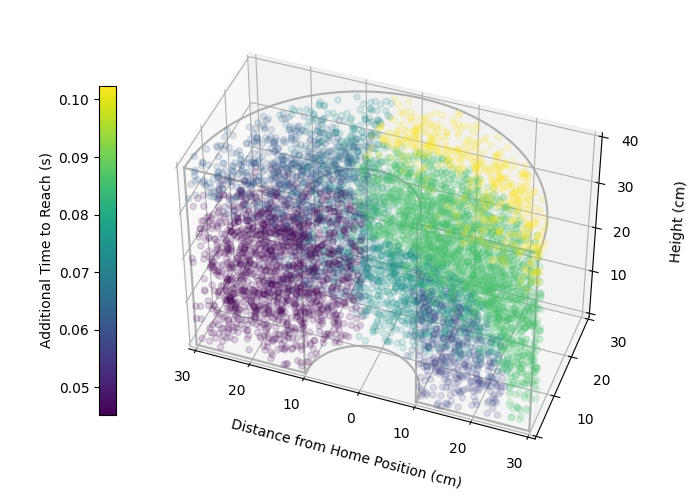
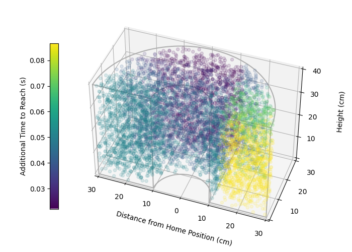

# Functional Difficulty Estimation

This repository contains the code and resources for the paper ``Modeling Personalized Difficulty of Rehabilitation Exercises Using Causal Trees" published at _2025 IEEE/RAS International Conference on Rehabilitation Robotics (ICORR)_. This project contains the code to create personalized difficulty models for rehabilitation tasks, enabling computational adaptation of task difficulty.

<p align="center">
  <figure style="display: inline-block; margin: 10px;">
    
    <figcaption style="text-align: center;">PID 27, right-affected</figcaption>
  </figure>
  <figure style="display: inline-block; margin: 10px;">
    
    <figcaption style="text-align: center;">PID 31, left-affected</figcaption>
  </figure>
</p>

## Modeling Functional Difficulty

Drawing upon the [Challenge Point Framework](https://en.wikipedia.org/wiki/Challenge_point_framework) (CPF), which posits that there is an optimal task difficulty for motor learning, this project focuses on quantifying _functional_ task difficulty – the difficulty of a task relative to an individual's skill – as distinct from _nominal_ task difficulty. Quantitatively estimating this difference is challenging due to high variance in performance measurements.
To address this, we adapt techniques from estimating heterogeneous treatment effects. We formalize individual exercise difficulty for a task x using the potential outcomes framework as:

τ(x)=E[Y(1)−Y(0)∣X=x]

Where Y(1) denotes the outcome measure of a post-stroke user performing the exercise x and Y(0) denotes the outcome measure of a neurotypical user performing exercise x, i.e., the nominal task difficulty. We estimate Y(0) from data collected from neurotypical users and Y(1) from individual post-stroke user data.


## The Framework

To use this framework to learn personalized difficulty models, you will need two key datasets:  

1. a dataset from users with limited mobility (e.g., `simplified_data/poststroke_data.csv`)
2. a dataset from normative use that can be used to estimate nominal task difficulty (e.g., `simplified_data/neurotypical_data.csv`)

Each dataset must contain the following columns:
- PID: a unique participant identifier
- 1...N task parameter columns
- an outcome measure column


## Installation

To set up the project environment, follow these steps:

1. Clone the repository:
```
git clone https://github.com/interaction-lab/stroke-exercise-difficulty-estimation.git
cd stroke-exercise-difficulty-estimation
```

2. Install the required dependencies. It is recommended to use a virtual environment:

Using venv:
```
python -m venv .venv
source .venv/bin/activate # On Windows, use `.venv\Scripts\activate`
```

Using conda:
```
conda create -n exercise_difficulty python=3.9
conda activate exercise_difficulty
```

3. Install dependencies
```
pip install -r requirements.txt
```

## Reproducing the Analysis

There are two main ways to reproduce the analysis presented in this paper:

1.  **Evaluate the pre-computed results:** If you want to quickly verify the main results using the data files provided (presumably elsewhere in the repo or linked), run the following command from the top-level project folder (`stroke-exercise-difficulty-estimation`):

    ```
    python -m src.scripts.analyze_test_results
    ```
    This script will process the existing result files and output the key performance metrics or summary tables.

2.  **Re-run the full experiments:** To generate the experiment results from scratch (e.g., to verify the experimental setup or run on different data splits), use this command from the top-level project folder:

    ```
    python -m src.scripts.run_all_experiments
    ```
    **Note:** This process involves training multiple models and evaluating them across different configurations. It is computationally intensive and may take a significant amount of time depending on your hardware.

## Visualizing Data

To visualize the plots used in the paper, you have a few options:

1.  **Visualize Causal Effect, Baseline, and Ground Truth Spatial Plots:**
    To view the 3D spatial graphs showing the estimated causal effect, baseline comparison, and ground truth data points for a specific participant, run the `src.viz.plot_tree` script:

    ```
    python -m src.viz.plot_tree --pid <participant_id>
    ```
    Replace `<participant_id>` with the numerical ID of the participant you want to plot (e.g., `21`). The `--pid` argument is required.

    *Optional arguments for `plot_tree`:* You can customize the plot generation using `--seed`, `--vmin`, `--vmax`, and `-v, --verbose`. Run `python -m src.viz.plot_tree --help` for details.

2.  **Visualize the Full Decision Tree Structure:**
    To visualize the structure of the underlying decision tree model used in the analysis (this might be one of the baseline models or a specific tree model from the pipeline), run the `src.viz.plot_dt` script:

    ```
    python -m src.viz.plot_dt --pid <participant_id>
    ```

    Replace `<participant_id>` with the desired participant's ID. The `--pid` argument is also required for this script. This will generate a graphical representation of the decision tree.

    Check if `plot_dt` has any optional arguments by running:

    ```
    python -m src.viz.plot_dt --help
    ```


## Citations

If you use this code or the concepts from this project in your research, please cite the relevant publications:

- **Causal Trees to Estimate Functional Difficulty** [Dennler 2025](https://arxiv.org/abs/2403.04109)
  ```
  @ARTICLE{dennler2025modeling,
    author={Dennler, Nathaniel and Shi, Zhonghao and Yoo, Uksang and Nikolaidis, Stefanos and Matari{\'c}, Maja J},
    journal={19th IEEE/RAS-EMBS International Conference on Rehabilitation Robotics (ICORR 2025)},
    title={Modeling Personalized Difficulty of Rehabilitation Exercises Using Causal Trees},
    year={2025},
    keywords={Rehabilitation robotics; Assistive robotics; Motor learning; Clinical evaluations},
    publisher={IEEE/RAS-EMBS},
  }
  ```

- **The BARTR Interaction** [Dennler 2023](https://www.science.org/doi/abs/10.1126/scirobotics.adf7723)
  ```
  @ARTICLE{dennler2023metric,
    author={Dennler, Nathaniel and Cain, Amelia and De Guzman, Erica and Chiu, Claudia and Winstein, Carolee J and Nikolaidis, Stefanos and Matari{\'c}, Maja J},
    journal={Science Robotics},
    title={A metric for characterizing the arm nonuse workspace in poststroke individuals using a robot arm},
    year={2023},
    volume={8},
    number={84},
    pages={eadf7723},
    keywords={Rehabilitation robotics; Assistive robotics; Motor learning; Clinical evaluations},
    publisher={American Association for the Advancement of Science},
    doi={10.1126/scirobotics.adf7723}
  }
  ```